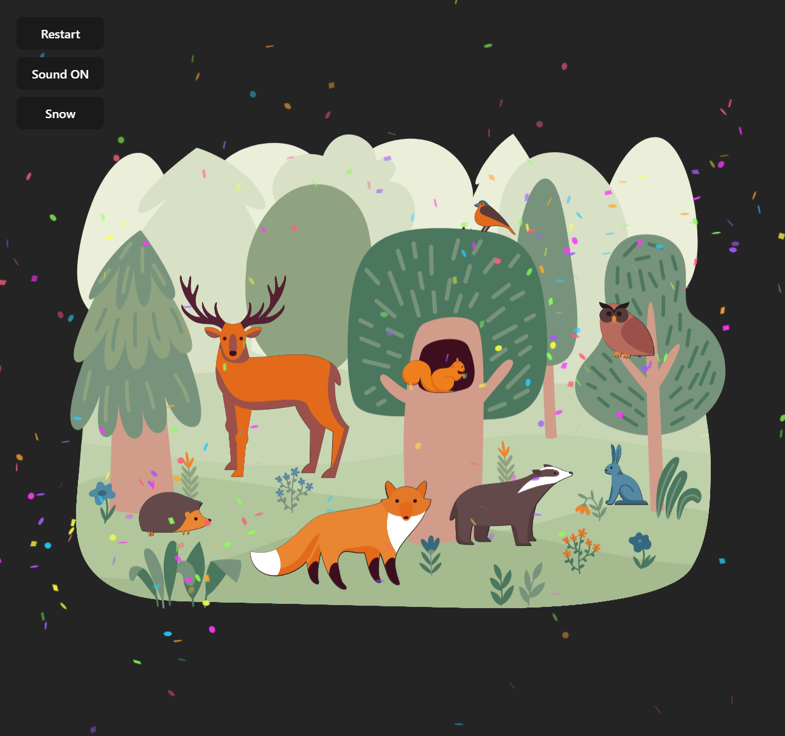
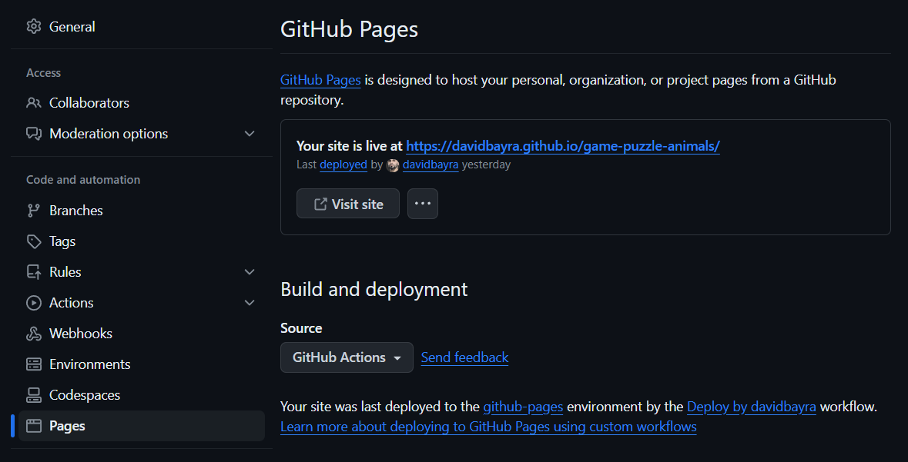
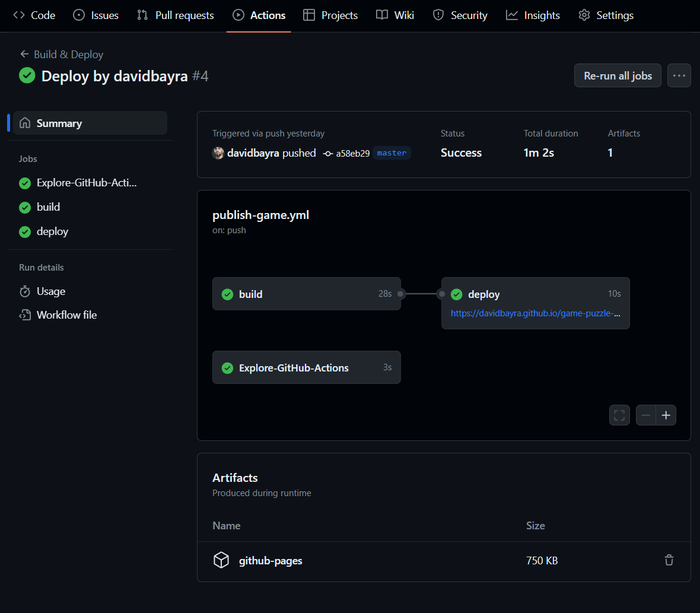

# Game puzzle animals


### Мини-игра пазл. Нужно расставить всех животных по своим местам.

Игру делал по урокам @dev.yesworld. В них автор на простом примере написанным 
в процедурном стиле, переписывает в объектноорентированный стиль
с использованием паттернов проектирования.

https://www.youtube.com/watch?v=rzPTPMg2E30&list=UULFRWYGOCWalOGOXnzqJd2MbQ&index=9

Использован сборщик vite+typescript

Установка зависимостей:
```shell
npm install
```
Запуска в режиме разработчика:
```shell
npm run dev
```
Собрать для продакшена:
```shell
npm run build
```
____
Так же автор @dev.yesworld реализовал в уроках github action, для сборки и развертывания проекта на GitHub.
Чтобы все заработало, в настройках проекта на GitHub в разделе Page -> Build and deployment -> Source, выберите **GitHub Actions**



В проекте в разделе Actions появится Deploy игры, где он сбилдится и развернется на сервере GitHub

